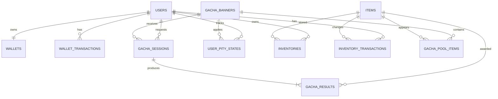

# ERD

## Index Policy

- `users(email)`, `users(nickname)`: unique index
- `gacha_sessions(idempotency_key)`: unique index
- `gacha_sessions(user_id, created_at)`: 사용자 로그 조회
- `gacha_results(item_id, created_at)`: 아이템별 확률 집계
- `gacha_results(was_pity_applied, created_at)`: 천장 보정 통계
- `inventories(user_id, item_id)`: unique index
- `user_pity_states(user_id, banner_id)`: unique index

복합 인덱스는 실제 집계 쿼리의 `EXPLAIN ANALYZE` 결과를 확인한 후 migration에 추가합니다.
