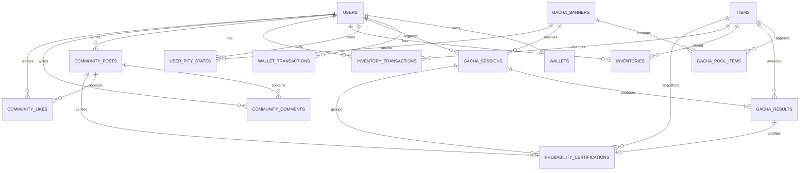

# ERD

## 커뮤니티 테이블

### community_posts

- 사용자 작성 게시글
- 카테고리, 이미지 URL, 좋아요 수, 조회수 저장
- `is_deleted`, `deleted_at` 기반 Soft Delete
- `(category, created_at)`, `(user_id, created_at)` 인덱스

### community_comments

- 게시글 댓글과 작성 사용자 연결
- `is_deleted`, `deleted_at` 기반 Soft Delete
- `(post_id, created_at)` 인덱스

### community_likes

- 사용자별 게시글 좋아요
- `(post_id, user_id)` unique constraint

### probability_certifications

- 게시글과 가챠 결과를 각각 unique FK로 연결
- 아이템 이름, 등급, 누적 추첨 수, 공식 확률, 개인 확률, 획득 시각 저장
- 원본 로그를 검증한 뒤 인증 당시 값을 유지하는 스냅샷
