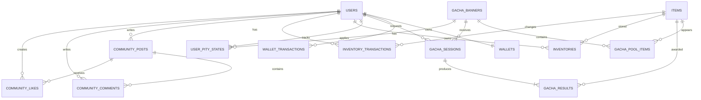

# ERD



## 커뮤니티 테이블

### community_posts

- 사용자 작성 게시글
- 카테고리, 이미지 URL, 좋아요 수, 조회수 저장
- `is_deleted`, `deleted_at`으로 논리 삭제
- `(category, created_at)` 목록 조회 인덱스
- `(user_id, created_at)` 사용자 게시글 인덱스

### community_comments

- 게시글 댓글
- 게시글 및 사용자 외래키
- `is_deleted`, `deleted_at`으로 논리 삭제
- `(post_id, created_at)` 댓글 목록 인덱스

### community_likes

- 사용자별 게시글 좋아요
- `(post_id, user_id)` unique constraint

## 다음 단계

`ProbabilityCertification`은 가챠 API와 이력 데이터가 구현된 후 다음 관계로 추가합니다.

```text
COMMUNITY_POSTS 1 -- 0..1 PROBABILITY_CERTIFICATIONS
GACHA_SESSIONS 1 -- 0..1 PROBABILITY_CERTIFICATIONS
ITEMS 1 -- N PROBABILITY_CERTIFICATIONS
```
