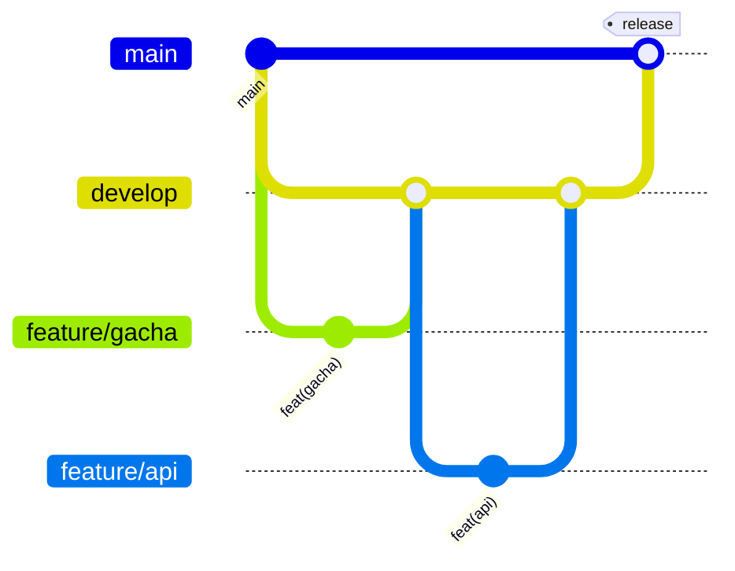

# Git 브랜치 및 커밋 전략

## 목적

이 문서는 Flutter, FastAPI, MySQL, 프로젝트 문서를 병렬로 개발하면서 `main`의 배포 가능 상태를 보호하기 위한 Git 표준을 정의합니다.

## 브랜치 구조



### main

- 항상 배포 가능한 상태를 유지합니다.
- 일반 기능 개발을 직접 수행하지 않습니다.
- 검증된 `develop`만 릴리스 Pull Request로 병합합니다.
- 긴급 수정이 필요하면 별도 feature 브랜치에서 수정하고 `develop`에도 반영합니다.

### develop

- 다음 릴리스를 위한 통합 브랜치입니다.
- 완료된 `feature/*` Pull Request만 병합합니다.
- 병합 전 Frontend, Backend, Docker 검증을 통과해야 합니다.
- 직접 커밋하지 않습니다.

### feature/*

- 모든 개발 작업은 `develop`에서 분기합니다.
- 이름은 `feature/<기능명>` 형식을 사용합니다.
- 하나의 기능 또는 변경 목적만 포함합니다.
- 완료 후 `develop` 대상으로 Pull Request를 생성합니다.
- 병합 후 원격과 로컬 feature 브랜치를 삭제합니다.

예시:

```text
feature/auth
feature/gacha
feature/inventory
feature/statistics
feature/community
feature/admin
feature/docs
```

## 표준 작업 흐름

```powershell
git switch develop
git pull origin develop
git switch -c feature/gacha

# 개발 및 테스트

git add .
git commit
git push -u origin feature/gacha
```

Pull Request 병합 후:

```powershell
git switch develop
git pull origin develop
git branch -d feature/gacha
```

## 릴리스 흐름

1. `develop`의 모든 테스트와 마이그레이션을 검증합니다.
2. `develop`에서 `main`으로 Pull Request를 생성합니다.
3. 릴리스 변경 사항을 확인합니다.
4. 리뷰와 CI 통과 후 병합합니다.
5. 필요하면 semantic version 태그를 생성합니다.
6. `main`의 릴리스 병합 결과를 `develop`과 동기화합니다.

## 커밋 메시지 형식

```text
type(scope): 한국어 설명
```

`type`과 `scope`는 영어 소문자이며, 설명에는 한글이 포함되어야 합니다.

허용 type:

```text
feat
fix
refactor
style
docs
test
chore
```

허용 scope:

```text
auth
gacha
inventory
statistics
community
admin
frontend
backend
api
database
user
docs
docker
erd
project
```

## 모듈별 커밋 예시

### Frontend

```text
feat(auth): 로그인 화면과 토큰 상태 관리 추가
feat(gacha): 10회 소환 결과 다이얼로그 구현
feat(inventory): 등급별 인벤토리 필터 추가
feat(statistics): 공식 확률 비교 차트 구현
feat(community): 확률 인증 게시글 화면 구현
feat(admin): 관리자 사용자 검색 화면 구현
refactor(frontend): 공통 카드 위젯 구조 개선
```

### Backend

```text
feat(backend): FastAPI 애플리케이션 초기 설정 추가
feat(api): 가챠 실행 API 엔드포인트 구현
feat(database): 인벤토리 복합 인덱스 추가
feat(user): 회원 논리 삭제 처리 구현
fix(api): 중복 요청 응답 상태 코드 수정
test(backend): 가챠 트랜잭션 통합 테스트 추가
```

### Project

```text
docs(docs): 개발 환경 실행 절차 작성
docs(erd): 가챠 로그 관계 모델 수정
chore(docker): MySQL 상태 확인 설정 추가
chore(project): Git 커밋 메시지 검증 설정 추가
```

## 커밋 단위

- 하나의 커밋에는 하나의 논리적 변경만 포함합니다.
- 기능 구현과 무관한 포맷 변경을 섞지 않습니다.
- DB 모델 변경에는 Alembic migration을 함께 포함합니다.
- API 변경에는 schema, service, endpoint, 테스트를 가능한 한 같은 기능 단위로 포함합니다.
- 생성 파일, 비밀값, 로컬 환경 파일은 커밋하지 않습니다.

## 병합 정책

- `feature/*` → `develop`: Squash merge를 권장합니다.
- `develop` → `main`: Merge commit을 권장합니다.
- 병합 전 최소 1회 리뷰를 권장합니다.
- GitHub Branch Protection에서 `main`, `develop` 직접 push를 차단합니다.
- `main`과 `develop`에 필수 상태 검사를 설정합니다.

권장 GitHub 설정:

| Branch | Pull Request 필수 | 승인 | 상태 검사 | 직접 push |
| --- | --- | --- | --- | --- |
| `main` | 예 | 1명 이상 | 필수 | 차단 |
| `develop` | 예 | 1명 이상 | 필수 | 차단 |

## 커밋 메시지 검증

저장소에는 `.gitmessage.txt`와 `.githooks/commit-msg`가 포함되어 있습니다.

clone 후 다음 설정을 실행합니다.

```powershell
git config commit.template .gitmessage.txt
git config core.hooksPath .githooks
```

검증 규칙:

- 허용된 type만 사용
- 허용된 scope만 사용
- type과 scope는 영어 소문자
- 설명에 한글 포함
- `type(scope): 설명` 형식 준수

Merge 및 Revert 자동 메시지는 예외로 허용합니다.

## GitHub Actions 검증

`.github/workflows/git-policy.yml`은 Pull Request마다 다음 규칙을 검사합니다.

- `main` 대상 Pull Request의 source 브랜치는 `develop`이어야 함
- `develop` 대상 Pull Request의 source 브랜치는 `feature/*`여야 함
- Pull Request에 포함된 모든 커밋 메시지가 프로젝트 규칙을 준수해야 함

GitHub Branch Protection에서 `Git Policy` 상태 검사를 필수로 지정해야 병합 차단이 적용됩니다.
